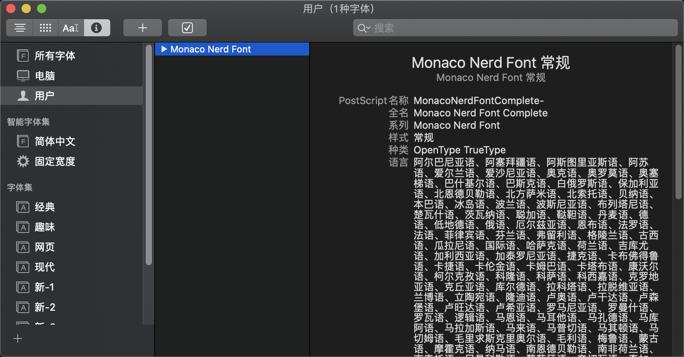
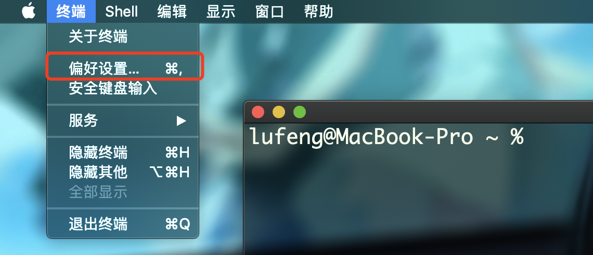
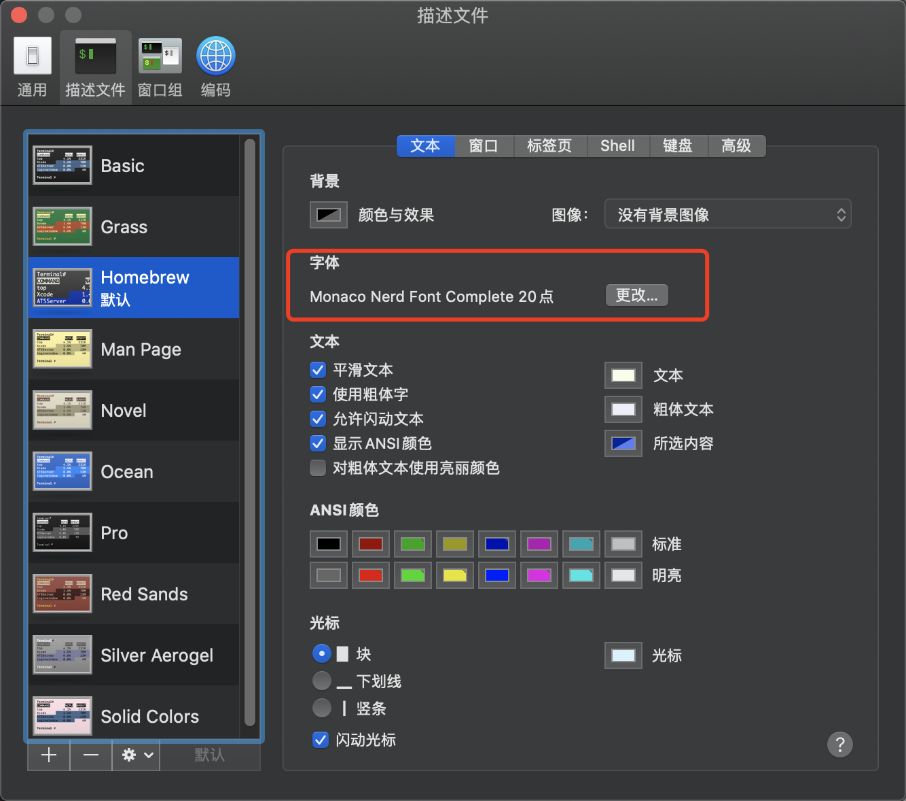
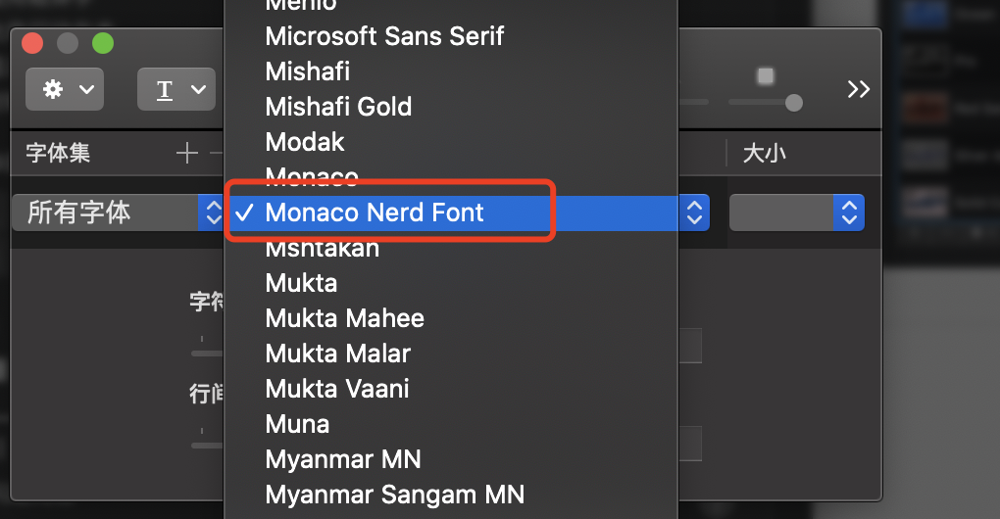
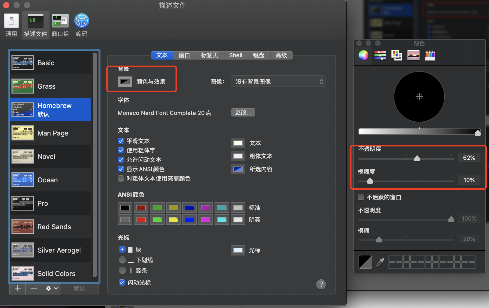
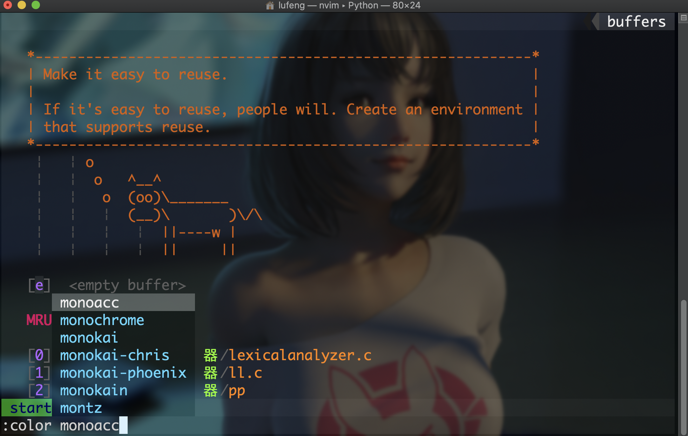

# iVimmer
You know,for efficiency......

To build a better editor on your Mac!
 

Thanks for [BOSS Huang](https://github.com/devilyouwei)'s [original version](https://github.com/devilyouwei/NVimmer)(for Linux) and help.

[中文版读我](README.md)

## Support

1. HTML CSS JS **[eslint]**
2. Java **[color enhanced]**
3. C# **[enhanced]**
4. vue
5. TypeScript
6. PHP
7. C/C++ **[enhanced]**
8. Markdown
9. JSON
10. Wechat wxml
11. react js/jsx/tsx **[new]**
12. Kotlin **[weakly support]**
13. English Words 1K+ **[new]**
14. Emoji (type `:` select emoji) **[new]**

NVimmer will use **Prettier and eslint** as the default linter and formatter for the fontend!

## Before Start
 （My Test environment is macOS Catalina 10.15.5）
 
 1.VPN is required if you are in China.
 
 2.update brew:
 ```bash
brew update
```
3.install wget:
```bash
brew install wget
```
4.Some support may need root authority,you can pass it if you don't want.

 
 
 ## Mac Onekey Install✈️✈️✈️
 
 ```bash
sh mac_install.sh
 ```

## Mac Manual🔨🔨🔨

### Download config files
I choose to Download orignal files(For Linux) by wget,other methods is OK only if you put them to the right place in your Mac.
```bash
wget -P ~/ https://raw.githubusercontent.com/devilyouwei/NVimmer/master/.prettierrc.json

wget -P ~/ https://raw.githubusercontent.com/devilyouwei/NVimmer/master/.eslintrc.json


wget -P ~/.config/nvim/ https://raw.githubusercontent.com/devilyouwei/NVimmer/master/nvim/coc-settings.json

wget -P ~/.config/nvim/ https://raw.githubusercontent.com/devilyouwei/NVimmer/master/nvim/init.vim


wget -P ~/.config/nvim/autoload/  https://raw.githubusercontent.com/junegunn/vim-plug/master/plug.vim
```

### Install Neovim
```bash
brew install neovim
```

### Install Node.js and npm
```bash
brew install node
brew install npm
```
### Plugin install
1.JavaScript
```bash
npm install -g neovim
npm install -g eslint
```
2.Ruby
(requiring "sudo") 
```bash
sudo gem install neovim
```
3.Perl
(requiring "sudo") 
```bash
sudo brew install cpanminus
cpanm Neovim::Ext
```
4.Python
```bash
pip install neovim  #python2
pip3 install neovim #python3
```
5.C/C++
```bash
brew install llvm
brew install ccls
```

6.Other
```bash
brew install ctags
brew install astyle
brew install clang-format
brew install shfmt
brew install lazygit
```
Nvim install plugins and quit then
```bash
nvim -c PlugInstall -c q -c q
```

## Font，zsh style，theme💃💃💃
1.Font
MonacoNerd is a self-made font while create customed characters.
```bash
wget -P ~/Library/Fonts/ https://github.com/devilyouwei/NVimmer/raw/master/fonts/linux/MonacoNerd.ttf
```
Ensure Monaco Nerd Font exists in your Fonts：

 
Choose Monaco Nerd Font in Teminal Preference：




2.zsh style
Set zsh transparency：


3.Choose Nvim Theme
[vim-colorschemes](https://github.com/flazz/vim-colorschemes) plugin has lots of vim themes to select,you can look them on the website or by using tab to auto complete.
```
:color monokai-phoenix
```


